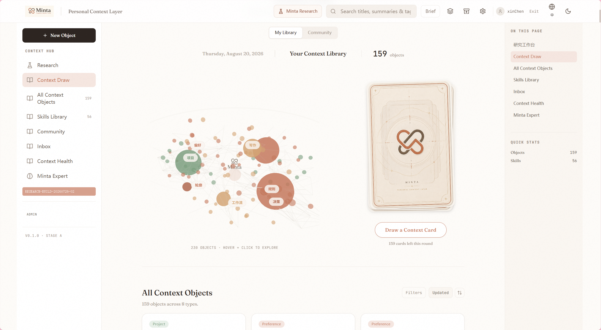
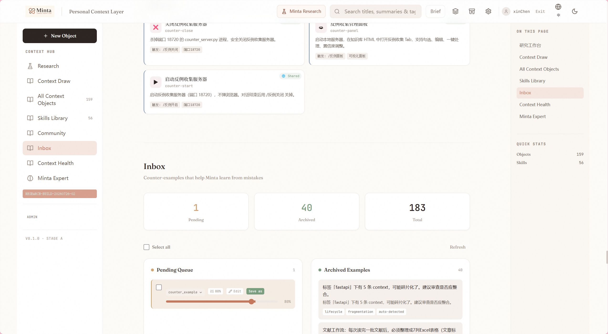
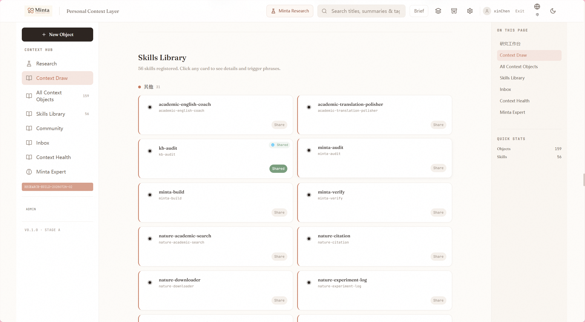
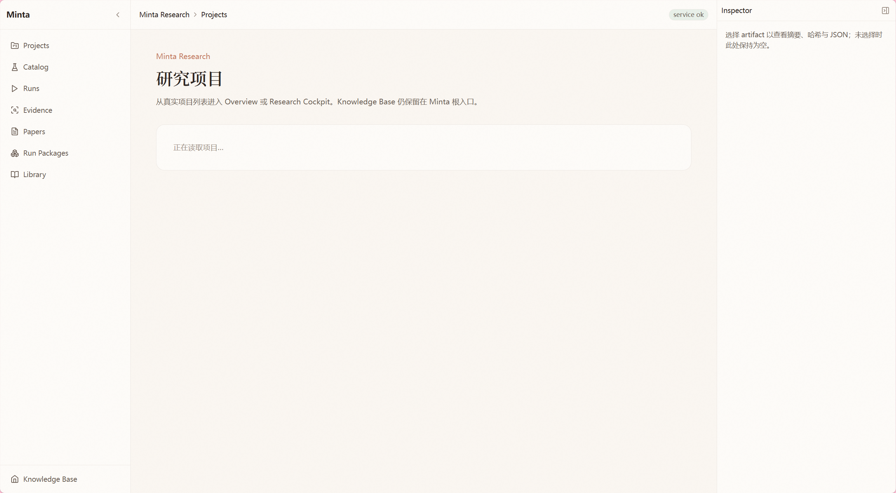
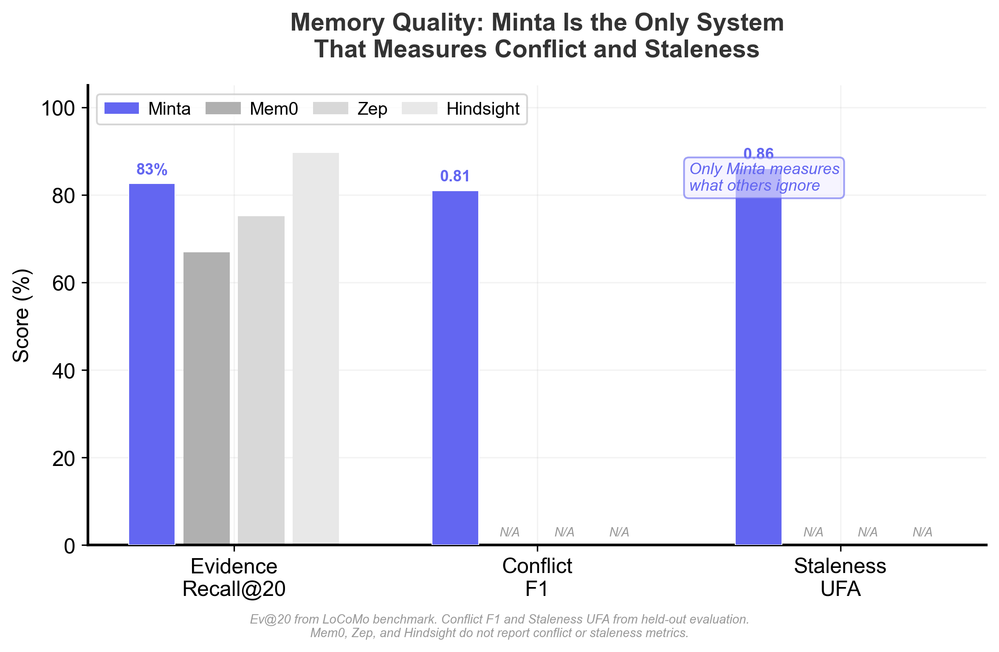

<p align="center">
  
</p>

<p align="center">
  <b>AI エージェントのためのコンテキスト品質レイヤー.</b><br>
  エージェントの記憶が<u>誤る</u>とき、Minta は「間違っている」— そして何が<u>言えないことか</u>を教えます。
</p>

<p align="center">
  <a href="README.md">English</a> · <a href="README_zh.md">中文</a> · <b>日本語</b>
</p>

<p align="center">
  <a href="#license"></a>
  <a href="#クイックスタート"></a>
  <a href="#deepseek-harness"></a>
  <a href="#ベンチマーク"></a>
</p>

> ⭐ 新着 (2026-08): **オープンコア v2** — メモリエンジン + 研究コンプライアンスエンジン + 専門ドメインパック、**DeepSeek Harness 統合(検証済み)**。

---

## Minta の理由

すべてのメモリシステムは「より多く保存する」ことに集中。Minta の仕事は、エージェントが知っていることが**依然として真実**であること、そして**やっていないことを主張しない**ことを守ることです。

| 他社は | Minta は |
|---|---|
| 「ここに関連する記憶」 | 「2 件が競合。1 件が陳腐化。事実はこれ」 |
| 永遠に保存 | 期限切れを検知し、フラグし、あなたが決める |
| すべて同じに扱う | 型別減衰: 好みはプロジェクト状態より長生き |
| LLM に任せる | ライフサイクルスキャン + 健康スコア + **ステージゲート**(過剰申告なし) |

**目次** · [なぜ Minta](#なぜ-minta) · [クイックスタート](#クイックスタート) · [機能](#機能) · [オープンコア](#オープンコアopen-code-locked-assets) · [ベンチマーク](#ベンチマーク) · [DeepSeek Harness](#deepseek-harness) · [ロードマップ](#ロードマップ)

## 製品 UI

完全な Minta ワークスペース(`Personal Context Layer`、V8.3 エンジン UI)。研究コックピット、エキスパート推論、メモリヘルスなど、下のエンジン階層に対応。オープンコアの dist はメモリハブ UI を同梱し、他のパネルは同じ API で有効化されます。

| | | |
|---|---|---|
|  |  |
| **Context Hub** — 「AI の再オンボーディングを止める」 | **Context Draw** — 3D ナレッジグラフ + カードリコール |
|  |  |
| **Context Health** — ライフサイクルダッシュボード | **Inbox** — 訂正の確認/破棄、反例レビュー |
|  |  |
| **Skills Library** — 50 登録ワークフロー | **Research Workspace** — プロジェクト、エビデンス、実行パッケージ |

3 つのレイヤー、1 つのエンジン:

```
L1 記憶ガバナンス → stale / conflict / redundant / fragile——見つけること、溜め込まないこと
L2 専門知識      → あなたの訂正から昇格するルール、ドメイン型
L3 クレームゲート → 「やっていない段階を主張できない」— 校正された信頼度つき
```

## クイックスタート

**60 秒。** ローカルファースト。クラウド不要。オープンコアにサブスクリプション不要。

```bash
git clone https://github.com/xinchen03/minta.git
cd minta
python -m pip install -r server/requirements.txt
python minta_cli.py start          # API :8772 · Autopilot :18730 · MCP :18721
```

または Docker: `docker compose up -d`。あなたのエージェントを接続:

```bash
# 任意の MCP 対応エディタ/エージェント — Claude Code / Codex / Cursor / dsh
python minta_cli.py connect claude
# DeepSeek Harness: dsh plugin --profile web add @xxinchen/dsh-plugin(MCP 接続は docs/dsh-integration.md)
```

Web UI は `http://127.0.0.1:8772` — メモリ健康ダッシュボード、3D 知識グラフ、受信箱レビュー、エキスパートパネル。

### 設定とキー(初回実行)

```bash
cp .env.example .env
python -c "import secrets; print('MINTA_API_KEY=minta_'+secrets.token_hex(32))"
```

**キー登録**: `minta_` プレフィックスだけでは API は受理しません — キー表に登録済みである必要があります。エンジン起動中に Web UI(設定 → API キー)またはユーザートークンで `POST /api/keys` を呼んで登録してください。書き込み系ツール(受信箱、write_context)には必要です。読み取り系は不要です。

| 変数 | デフォルト | 説明 |
|---|---|---|
| `MINTA_DATABASE_URL` | `sqlite:///./minta.db` | ゼロ設定 SQLite;1 行で MySQL へ |
| `MINTA_JWT_SECRET` | *(要設定)* | セッション署名シークレット — 生成する、コピーしない |
| `MINTA_API_KEY` | 初回起動時に自動生成 | プログラムアクセス + MCP(`python minta_cli.py connect claude`) |

変数リファレンス(SMTP、CORS、フラグ)→ [`docs/configuration.md`](docs/configuration.md)。エージェント接続 → [`docs/mcp-integration.md`](docs/mcp-integration.md)。

## 機能

| レイヤー | 機能 | 得られるもの |
|---|---|---|
| 記憶 | ハイブリッド検索(ベクトル + BM25 + エンティティ + FTS) | 正しい記憶を選ぶ |
| 記憶 | ライフサイクルエンジン(減衰/競合/冗長/断片化) | 品質チェックが定期的に走る |
| 訂正ループ | 受信箱 + 反例キャプチャ(フック: SessionStart → PostToolUse → Stop) | 訂正がルールに昇格(確認後) |
| 専門ドメイン | マルチドメインルール(足首/膝/頚椎、ISO9001、PRISMA…) + CUMCM 段階ワークフロー | 信頼度つきドメイン推論 |
| 研究 | 原稿インベントリ + コンプライアンス評価 | 投稿前チェック |
| メタ認知 | 共形信頼度(校正・データロック) | カバレッジ保証つきの「知っている」 |
| 提供 | Web dist + MCP(19 ツール)+ DSH プラグイン検証済み | 3 つの入口、1 つの記憶 |

## オープンコア(Open Code, Locked Assets)

| このリポジトリ(Apache-2.0、無料) | API キー / エンタープライズライセンス |
|---|---|
| メモリエンジン — 完全・実行可能 | マネージドエンジン + モニタリング |
| 品質カーネルアルゴリズム(共形/ルール昇格/DGM/コンパイラ) | 全精度: 自動校正、プライベートドメイン |
| 研究コンプライアンスエンジン + ドメインパック | スポーツ医学 / 臨床パック |
| Web dist · MCP · DSH 統合 · 12 ガイド | データフライホイール: 校正セット、重み、ルールベース |

上の表の右側のホステッド層は**将来のロードマップ機能**です — オープンコアは常に完全・実行可能なメモリシステムです。

## ベンチマーク



| 検出 | 指標 | スコア | Mem0 | Hindsight |
|---|---|---|---|---|
| 競合 | F₁ | 0.81(held-out、未見 5 ドメイン) | なし | なし |
| 陳腐化 | UFA | 0.86(12 事実ペアテンプレート) | なし | なし |
| 冗長 | 圧縮 RR | 0.67(25 クラスタ) | なし | なし |
| 断片化 | MCR | 0.746(15 フラグメント) | なし | なし |
| 検索(LoCoMo) | Recall@20 | 97.1% | — | — |

## 研究ファースト

Minta はもともと研究ワークフローのメモリ層として始まりました — 文献ノート、原稿チェックリスト、ジャーナルコンプライアンス。`runtime/compliance/` と `docs/interaction-guide.md` 参照。フレームワーク(メモリ品質・データガバナンス)の論文は執筆中です。

補完スキル(Apache-2.0、別リポジトリ): [nature-skills](https://github.com/Yuan1z0825/nature-skills) — 読解、図、引用、推敲。


## DeepSeek Harness

検証済み統合 (2026-08): `dsh plugin --profile web add @xxinchen/dsh-plugin` で接続 — プラグインが公式 `dsh-mcp-client` 行を自動合成します(エンジンは別途デプロイされ、19 個の `minta_*` ツールを提供)。手動 `cordis.patch.yml` 挿入にも対応。詳細は `docs/dsh-integration.md`。プラグイン 0.2.0 には `minta` コピー済みプリセット(毎ターン記憶プロトコル)も同梱 — `dsh-plugin/presets/minta` を `~/.dsh/.agent-presets/` にコピーするとセッション選択で利用できます。

## ビルドとコントリビュート

```bash
python scripts/build_open_release.py
python -m pytest tests/
```

good-first-issue PR 歓迎: `entity_linker` の英語パターン、実在感のあるデモシナリオ。詳細は `CONTRIBUTING.md`。

## ガイド

[インタラクションガイド](docs/interaction-guide.md) · [起動順序](docs/startup-chain.md) · [DSH 統合](docs/dsh-integration.md) · [設定](docs/configuration.md) · [ユーザーガイド](docs/user-guide.md) · [MCP 統合](docs/mcp-integration.md)

## データとプライバシー

- ローカルファースト: データベース・ベクトル・ログはマシン内に留まる。デフォルトでテレメトリなし。
- エクスポート/削除: `GET /api/user/export-data` · `DELETE /api/user/delete-data`(認証済み)。
- シークレット: 初回実行時に生成(`.minta_api_key`、コミット回避)。特権 API は明示的に設定しない限り無効。
- 開示ポリシーは `SECURITY.md`。

## ビジョン: どこへ向かうか

記憶は簡単。**真実が製品。** エージェント時代には「もっと覚える」システムが溢れていますが、ボトルネックは逆——AI が古く、矛盾し、根拠のない主張を自信満々に示すこと。Minta の答えは**コンテキスト品質レイヤー**: 記憶は自らの健康を知り(`stale / conflict / redundant / fragile`)、エキスパート層は自らの限界を知り(校正済みカバレッジ)、クレームゲートは「実際にやったか」を知る。長期的テーゼ:

- **個人**: すべての AI アシスタント、すべてのセッションは「あなたを理解したコンテキストハブ」から始まる — AI の再オンボーディングを止める。
- **チーム/企業**: 研究グループや臨床ユニットで記憶・専門知識・コンプライアンスを共有 — 監査トレイルとガバナンスレポート付き。
- **垂直展開**: スポーツ医学、臨床トリアージ、製造エキスパートパックを同じエンジンに、ユーザーの訂正で強化(データフライホイール)。

## コミュニティと連絡

- 🐛 **GitHub Issues** — バグ、機能リクエスト(迅速対応)
- 💬 **GitHub Discussions** — 質問、RFC、作品披露
- 📧 **連絡先**: xxinchen03@gmail.com(研究協力・相談)

## スターをお願いします


## 思想的起源と系譜

| 仕事 | Minta が取るもの | Minta の違い |
|---|---|---|
| **Mem0 / MemOS** | メモリストア + ハイブリッド検索 | 彼らは保存、Minta は*検証*(減衰・競合・冗長・断片化) |
| **Vovk (2005) 共形予測** | 分布自由カバレッジ保証 | *メタ認知ゲート*として使用 |
| **JEPA (LeCun)** | 潜在空間での予測 | ドメインルール > JEPA — 履歴あるときのみ予測 |
| **エビングハウス減衰 (MemoryBank 等)** | 時間認識の忘却 | タイプ別半減期: 好み > プロジェクト状態 |
| **Paperclip 文書メンテナンス** | 監査駆動のメンテナンス | 同じ規律、今はファイルでなく AI 記憶に |

## ロードマップ

- **2026 Q4** — ホステッド API(全精度・モニタリング)、スポーツ医学パック、npm プラグイン v1
- **2027 Q1** — エンタープライズオンプレミス + ガバナンス監査レポート、SME エンジン公開
- **2027** — マルチエージェント共有メモリワークスペース

## ライセンス

Apache-2.0。上流バンドル資産は各ライセンスを保持 — 後日 `skills/` 参照。
